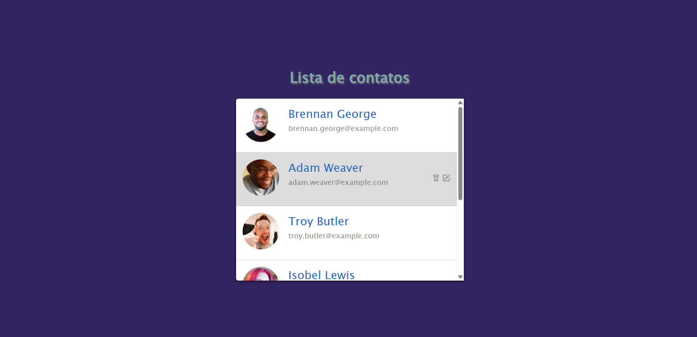
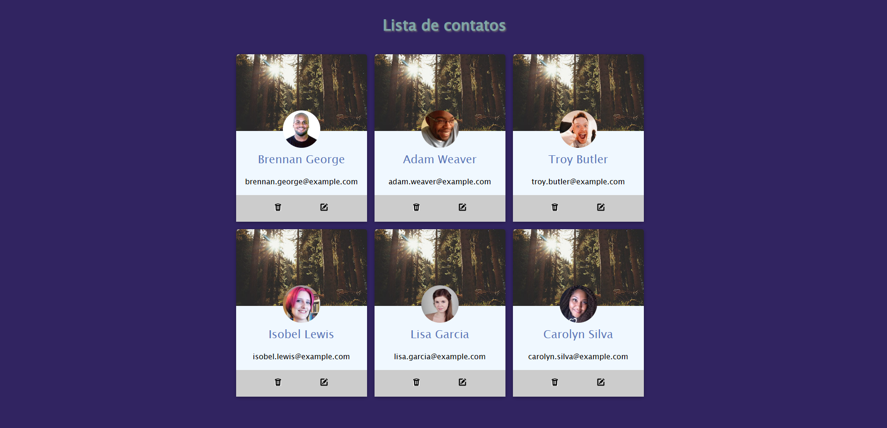

# 📇 Projeto Lista de Contatos

Este projeto consiste em uma interface simples de **Lista de Contatos**, desenvolvida com o objetivo de praticar conceitos fundamentais de **HTML e CSS**.

A aplicação apresenta uma lista de usuários contendo foto, nome e e-mail, organizados em um layout limpo e de fácil visualização.

## 🎯 Objetivo do Projeto

O principal objetivo deste projeto foi reforçar conceitos importantes do desenvolvimento front-end, como:

- Estruturação de páginas com HTML
- Estilização de componentes utilizando CSS
- Organização visual de elementos de interface
- Construção de layouts simples e funcionais

Este projeto faz parte da minha jornada de aprendizado em **Desenvolvimento Web**, onde estou focado em fortalecer minha base em **HTML, CSS e posteriormente JavaScript**.

## 🛠 Tecnologias utilizadas

- HTML5
- CSS3

## 📌 Funcionalidades

- Exibição de lista de contatos
- Foto de perfil dos usuários
- Nome e e-mail de cada contato
- Interface limpa e organizada

## 🚀 Objetivo de aprendizado

Este projeto foi desenvolvido como prática durante meus estudos em desenvolvimento web, buscando melhorar habilidades de criação de interfaces e organização de layouts.

## 🔗 Visualização do Projeto

https://devbymatheus.github.io/Projeto-Contato

## 📸 Preview

